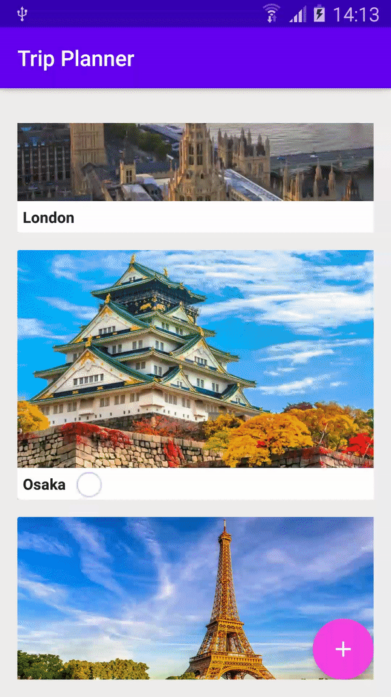

# Trip Planner

## Story

You woke up today with the great plan of travelling around the whole world. After spending half an hour browsing through the available planning apps, you decide to write your own instead which will obviously be perfect. It will be a helpful solution to collect your destinations into a database, and display them on a map.

## Demo Product

## What are you going to learn?

- organize code with MVP architecture,
- use the `Room` library for storing data in database,
- show locations on `Google Maps`,
- load images with Picasso,
- learn the concept of `Async Tasks`.

## Tasks

1. The app has an Activity where all the data is displayed about each destination.

    - The package name is `com.codecool.tripplanner`, and the name of the application is `Trip Planner`
    - Destinations are saved into a Room database. The model contains at least a title, a gps coordinate and an url of a picture that shows the location
    - Use a `RecyclerView` to display the information
    - The project is using the MVP Architecture pattern
    - An image of each destination is displayed using the Picasso library to load it from the url
    - While the app is loading data, a gray overlay and a progressbar is displayed on top of the list.
    - When the list of destinations is empty, a text is displayed on the screen to inform the user, not just the empty `RecyclerView`

2. There is an Activity where the user can add a new location and save it to the database

    - This screen uses a `ConstraintLayout` to offer a form, where the destionation details can be typed in
    - The save `Button` has a different pressed state than the normal background

3. There is an Activity where the selected destination is displayed on a map

    - This feature uses the Google Maps library

4. The app needs to have a custom icon and handle device rotation.

    - The application has an icon other than the default
    - The application handles device rotation

## General requirements

 - All colors, dimens and string resources in the project are extracted into their respective xml files.

## Hints

- If your app needs to connect to the internet, you'll have to add a permission to the `AndroidManifest.xml`

## Starting repository

Follow [this link](https://journey.code.cool/v2/project/solo/blueprint/trip-planner/java) to create your project repository.

## Background materials

- :open_book: [Constraint layout](https://codelabs.developers.google.com/codelabs/constraint-layout)
- :exclamation: [Async task](https://codelabs.developers.google.com/codelabs/android-training-create-asynctask)
- :exclamation: [MVP Architecture](https://medium.com/upday-devs/android-architecture-patterns-part-2-model-view-presenter-8a6faaae14a5)
- :open_book: [MVP example project](https://github.com/MindorksOpenSource/android-mvp-architecture)
- :exclamation: [Room persistence library](https://codelabs.developers.google.com/codelabs/android-room-with-a-view)
- :open_book: [Room protips](https://medium.com/androiddevelopers/7-pro-tips-for-room-fbadea4bfbd1)
- :open_book: [LiveData](https://developer.android.com/topic/libraries/architecture/livedata#java)
- :exclamation: [Google Maps](https://developers.google.com/maps/documentation/android-sdk/utility)
- :open_book: [Good and short Room summary video but in Kotlin](https://www.youtube.com/watch?v=SKWh4ckvFPM)
- :open_book: [Picasso](https://square.github.io/picasso/)
